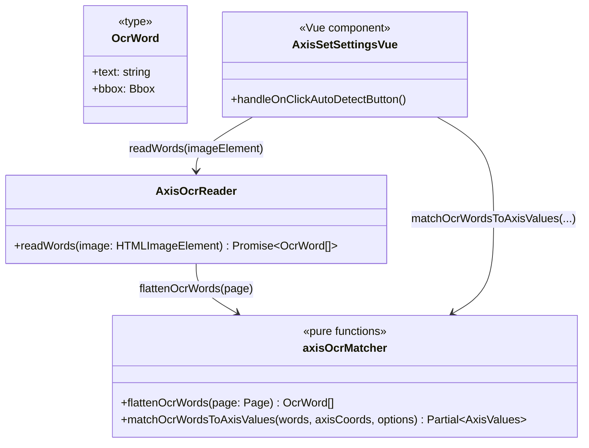

# 実装設計: 軸ラベルOCR自動検出(最小版)

HQ #42。スコープはHQ指示どおり最小に絞る: フル自動軸検出(軸線位置そのものの検出)ではなく、
**ユーザーが従来どおりキャンバス上でx1/x2/y1/y2の軸座標(ピクセル位置)をクリック指定した後、
その近傍にある数値ラベルをtesseract.jsでOCRして軸値入力欄に自動セットする**機能。

## 方針

- 誤検出時の専用フォールバックUIは作らない。OCR結果は既存の軸値入力欄(`AxisSetSettings.vue`)にそのままセットするだけで、
  違っていればユーザーが今までどおり手入力で上書きすればよい(既存UIが既にフォールバックとして機能する)。
- 軸ピクセル座標(x1/x2/y1/y2、`AxisInterface.coord`)は既に画像上の実座標なので、OCRで得た各単語のbounding box中心との距離が
  最も近いものをその軸の値として採用する、という単純な最近傍マッチングのみ行う。座標→軸の対応関係を機械学習等で判定するようなことはしない。
- 1枚の画像に対してOCRは1回だけ実行し(`Tesseract.recognize`は数秒かかる処理)、結果を4軸に配り分ける。

## 既知の制約(ドキュメントに明記し、フォールバックUIの代わりとする)

- 単語ごとに独立して最も近い軸を探すだけなので、2つの軸ラベルが非常に近接している場合に同じ単語が複数の軸にマッチする可能性がある
- `maxDistancePx` (既定150px、画像のオリジナルピクセル座標系)を超える位置にしか数値ラベルが見つからない軸には値をセットしない(近くに何もない場合に無関係な値を拾わないため)
- 数値として解釈できない(桁区切りカンマ、単位付きなど)OCR結果は無視する。桁区切りカンマ対応などは将来の拡張

## クラス図

- `axisOcrMatcher.ts` (`src/application/utils/`): tesseract.js の型に依存しない純粋関数(ローカルに構造的部分型を定義)。DOM/ブラウザAPIに触れないためJestで100%カバー可能
- `AxisOcrReader` (`src/application/services/axisOcr/`): `tesseract.js` の `recognize()` を呼ぶ薄いI/Oラッパー。`ProjectService`と同様、アプリケーション層に置きつつDOM/外部ライブラリ呼び出しはここに閉じ込める
- Vue側は「ボタンを押す→ローディング表示→結果を軸値入力欄と同じ`setX1Value`等の既存APIで反映」するだけ
- 誤検出時のフォールバック手段は既存の軸値入力欄への手入力そのもの。専用UIは作らない(HQ指示どおり)
- 本機能は #248 (Undo/Redo)とは独立したブランチ・PRとして進行中のため、`historyManager`等その成果には依存しない。将来的にマージ後、OCR適用前の `historyManager.capture()` 呼び出しを足すと誤操作からの一括復帰ができるようになる(TODO)

## 対象外(今回やらないこと)

- 軸線・目盛線そのものの画像認識(エッジ検出等)
- OCR結果の信頼度に応じたハイライト表示や確認ダイアログ
- 桁区切りカンマ、指数表記(`1e+3`等)のOCRテキスト正規化
