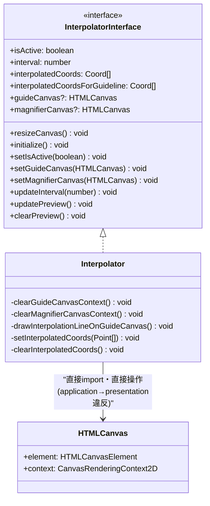
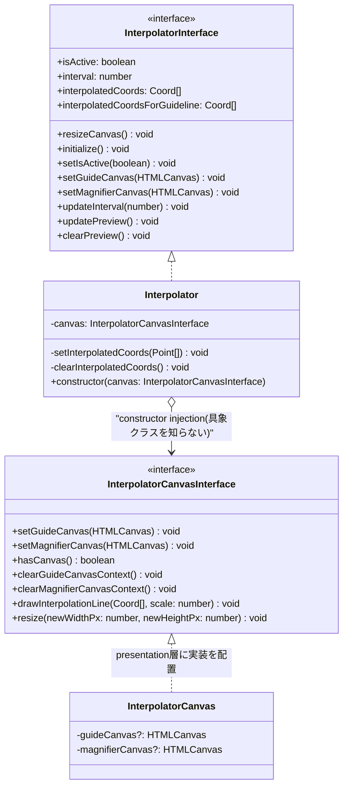

# Interpolator: canvas描画ロジックの分離設計

対応issue: #111 "Move html canvas logic in the Interpolator application to the presentation layer"

## 課題

`src/application/services/interpolator/interpolator.ts`(application層)が、
`@/presentation/dom/HTMLCanvas`(presentation層)を直接importし、canvas描画・
クリア処理を自身のメソッドとして実装していた。application層がpresentation層
に依存する形になっており、依存方向のルール(内側=domain/applicationは外側=
presentationを知らない)に反していた。

これにより、`Interpolator`のユニットテストを書こうとすると、実DOM
(`document.getElementById`等)やcanvasのモックが必須になり、補間座標の計算
ロジック(本来ここでテストしたい対象)まで含めてテストが複雑になっていた。
実際、このクラスには2026-08-31時点でユニットテストが1つも存在しなかった。

## Before

`Interpolator`が持つcanvas関連の責務(いずれもDOM操作):
- `clearGuideCanvasContext()` / `clearMagnifierCanvasContext()`: canvasの`clearRect`
- `drawInterpolationLineOnGuideCanvas()`: `moveTo`/`lineTo`/`stroke`での描画、
  および結果を`magnifierCanvas`へ`drawImage`でコピー
- `resizeCanvas()`: canvas要素の`width`/`height`変更と再描画

## After

canvas操作一式を `InterpolatorCanvasInterface` という Port として切り出し、
`Interpolator` はこの interface のみに依存する(実装を知らない)。実装クラス
`InterpolatorCanvas` は presentation層に置き、DI(コンストラクタインジェクション)
で `Interpolator` に注入する。

### 依存方向

- `Interpolator`(application) は `InterpolatorCanvasInterface`(application層に
  置くPort定義)にのみ依存する。具象実装 `InterpolatorCanvas`(presentation層)
  を知らない。
- 実際に `Interpolator` に `InterpolatorCanvas` を注入するのは
  `InterpolatorManager`(DIコンテナ的役割、`interpolatorInterface.ts` と同じ
  ディレクトリに置かれ、presentation層のクラスを import する)。これは既存の
  他サービス(`canvasHandler`等)にもある「manager が実装の配線をする」構造を
  踏襲している。

### 既存呼び出し元への影響

`setGuideCanvas` / `setMagnifierCanvas` / `resizeCanvas` は
`InterpolatorInterface` にそのまま残し、内部で `this.canvas.xxx()` に委譲する
だけにする。`CanvasMain.vue` 等の既存呼び出しコードは変更不要。

### テスト容易性の変化

- Before: `Interpolator` のテストには実DOM/canvasモックが必須で、補間計算
  ロジックのテストと絡み合っていた。
- After: `InterpolatorCanvasInterface` のテストダブル(jest.fn()ベースのモック)
  を注入するだけで、DOMに一切触れずに `Interpolator` の計算・状態遷移ロジック
  (updatePreview/clearPreview/updateInterval等)をテストできる。
