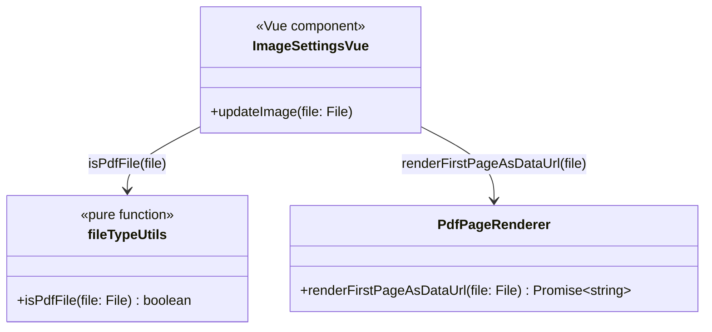

# 実装設計: PDFから図を抽出して読み込み(HQ #39, 最小版)

## スコープ

「PDFファイルをアップロードすると1ページ目を画像としてレンダリングし、既存の画像読み込みフロー
(`ImageSettings.vue` の `updateImage`)にそのまま流し込む」最小版。複数ページのPDF内から
ページを選ぶUI、PDF内の複数の図を自動検出するようなことは行わない(1ページ目固定)。

## 方針

- `pdfjs-dist` を新規依存として追加し、PDFの1ページ目を `<canvas>` にレンダリングして
  `canvas.toDataURL('image/png')` を得る。これは既存の画像アップロードフロー
  (`FileReader.readAsDataURL` が返すのと同じ形の `data:image/png;base64,...` 文字列)と
  完全に互換なので、`canvasHandler.initializeImageElement(dataUrl)` 以降の処理
  (軸/データセットのリセット等、`ImageSettings.vue` に既にある共通ロジック)は一切変更しない
- PDFのレンダリングは `src/application/services/pdfImport/pdfPageRenderer.ts` に閉じ込める。
  `tesseract.js`(`AxisOcrReader`, HQ #42)と同じ構成: 3rd-partyライブラリ呼び出しの薄いI/Oラッパー
  + テスト可能な部分を分離
- Worker: `pdfjs-dist/build/pdf.worker.min.mjs?url`(Viteのasset URL import)を
  `GlobalWorkerOptions.workerSrc` に設定。ローカルでもVercelでも同じ仕組みでバンドルされる
  (HQ #42のバグ調査で学んだ教訓 — 3rd-partyライブラリの呼び出しは実機で1回動作確認するまで
  信用しない)

## クラス図

## 変更箇所

- `src/presentation/components/Settings/ImageSettings.vue`
  - `v-file-input` の `accept` に `application/pdf` を追加
  - `updateImage(file)` の冒頭で `isPdfFile(file)` を見て、PDFなら
    `pdfPageRenderer.renderFirstPageAsDataUrl(file)` の結果を、画像ならこれまでどおり
    `readFile(file)` (FileReader) の結果を使う。以降の処理(`canvasHandler.initializeImageElement`
    以下)は完全共通
  - ドラッグ&ドロップ(`dropFile`)は `updateImage(file)` を呼ぶだけの既存コードなので無変更でPDFに対応
  - クリップボード貼り付け(`onImagePasted`)はPDF非対応のまま(ブラウザのクリップボードAPIで
    PDFファイルをファイルとして貼り付けられるケースが一般的でないため、スコープ外)

## 実装中に発覚した問題と対処

`pdfjs-dist` をトップレベルの `import` にしたところ、Cypress E2Eをローカルで実際に実行して初めて
「PDF機能を一切使わないテストまで含めて、アプリ全体が `ReferenceError: Iterator is not defined` で
起動時にクラッシュする」ことが判明した(Cypressが使うElectron 106のChromiumエンジンが
`pdfjs-dist@6` の内部実装が前提とする新しいJS機能(`Iterator` ヘルパー)に未対応だったため)。
`import * as pdfjsLib from 'pdfjs-dist'` はモジュール評価時にpdfjs-dist自身のトップレベルコードを
即実行してしまい、メインバンドルに混入していたのが原因。

対処: `PdfPageRenderer.renderFirstPageAsDataUrl` の中で `pdfjs-dist` を動的 `import()` に変更し、
実際にPDFがアップロードされた時だけ評価されるようにした。これによりPDF機能を使わない限り
既存のE2E/アプリ全体には一切影響しない。既知の残存リスクとして、古いブラウザエンジンで
実際にPDFをアップロードした場合はこの動的importの時点で同様のエラーになりうる
(コンソールにエラーが出て `updateImage` の既存catchで握りつぶされるのみ)。専用の
エラーメッセージ表示は今回のスコープ外(HQ指示の最小版方針に合わせる)。

**教訓(HQ #42と同種)**: 3rd-partyライブラリを導入したら、そのライブラリを一切使わない既存の
E2Eスイートも必ず実機(実ブラウザ相当)で再実行してから完了報告すること。単体テストのモックだけでは
この種のバンドル混入バグは検出できない。

## テスト方針

- `fileTypeUtils.isPdfFile` は純粋関数としてJestで直接テスト
- `PdfPageRenderer` は `pdfjs-dist` をモックし、「1ページ目を要求すること」「取得したcanvasから
  `toDataURL` を呼ぶこと」の契約をユニットテストで担保する(HQ #42のOCRバグと同種の
  「呼び出し方の誤り」を防ぐのが目的。実際のPDFレンダリング結果はJest上では検証できないため、
  Vercelプレビューでの実機確認を必須とする)
