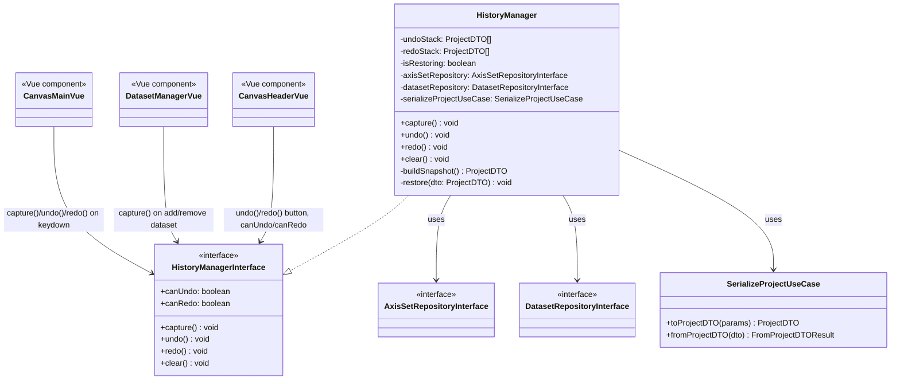

# 実装設計: Undo/Redo履歴 & JSONエクスポート

`docs/design/feature-ideas.md` で選定した上位2機能の設計。クリーンアーキテクチャ方針(`docs/design/plot-digitizer-architecture.md`)に従い、依存方向は常に `presentation → application → domain` の内向き一方向を維持する。

## 1. Undo/Redo履歴

### 課題

現状、ポイント追加/削除/移動、軸座標の設定・移動、データセットの作成/削除を誤操作しても取り消す手段がない。`window.confirm` によるガードはあるが、細かい操作(ポイントを1つ間違えて置いた等)には対応できない。

### 方針

`ProjectService` が既に持っている `SerializeProjectUseCase`(`AxisSet`/`Dataset` ⇄ `ProjectDTO` の相互変換、`@plot-digitizer/core` 提供)をそのまま再利用し、**スナップショット方式**でUndo/Redoスタックを実装する。差分(コマンドパターン)ではなくスナップショット全体を積むことで実装コストを抑える。

- スナップショット対象: `axisSetRepository.axisSets` / `datasetRepository.datasets` とそれぞれの `active*Id`
- スナップショット対象外: `canvasHandler`(拡大率・操作モード)、アップロード画像そのもの — ズーム変更や画像差し替えまでUndo対象にすると「元に戻す」の直感に反するため明示的に除外する(画像差し替えは別途確認ダイアログで保護済み)
- スタック上限: 50(メモリ肥大化防止)
- `capture()` の呼び出しはPresentation層(Vueコンポーネントのイベントハンドラ)側の責務とする。ミューテーションの粒度をアプリケーションサービス側で自動検知するのはコストが高く、既存の各操作ハンドラの最後に明示的に1行足す方式を採る

### クラス図

依存方向: `presentation`(Vue) → `application`(HistoryManager) → `domain`(Repository Interface)。`HistoryManager` は `SerializeProjectUseCase`(`@plot-digitizer/core`)にのみ依存し、DOM/Vueには一切依存しない。既存の `ProjectService` と同じ層構成。

### 配置

- `src/application/services/historyManager/historyManagerInterface.ts`
- `src/application/services/historyManager/historyManager.ts`
- `src/instanceStore/applicationServiceInstances.ts` に `historyManager` を追加。コンストラクタが `axisSetRepository`/`datasetRepository` に依存するため、`InstanceManager` 経由のSingletonラッパーは使わず `ProjectService` と同じ「直接1回だけ `new` する」方式を踏襲する

### UI

- `CanvasHeader.vue` に Undo / Redo ボタン(`mdi-undo` / `mdi-redo`)を追加。`historyManager.canUndo`/`canRedo` で活性・非活性を制御
- `CanvasMain.vue` の `keyDownHandler` に `Ctrl/Cmd+Z`(Undo)、`Ctrl/Cmd+Shift+Z`(Redo)を追加
- `capture()` 呼び出し箇所: ポイント追加(`point()`)、軸座標追加、ポイント削除、ポイント移動(矢印キー)、軸移動(矢印キー)、データセット作成/削除/全消去/ポイントクリア

### テスト方針(TDD)

`historyManager.test.ts` で以下をカバー:
- capture後にundoで直前の状態に戻ること
- undo後にredoでき、undo/redo交互の整合性が保たれること
- capture時にredoスタックがクリアされること(分岐後の未来を破棄)
- スタック上限を超えたら古いものから破棄されること
- canUndo/canRedoの真偽値

## 2. JSONエクスポート追加

新規クラスは設けず、既存の `Export/DataTable.vue`(全体エクスポート)と `DatasetManager.vue`(データセット単位エクスポート)にJSON出力を追加する。CSV変換ロジックと対になる形で、純粋関数 `src/application/utils/exportFormatUtils.ts` に `toCsv` / `toJson` を切り出しユニットテスト対象にする(Vueコンポーネント側はJestのcoverage収集対象外のため、ロジックは必ずこちら側に置く)。

- `toJson(points: {X: string, Y: string}[]): string` — `JSON.stringify` した文字列を返す
- 各コンポーネントに「Copy as JSON」ボタン、または既存ボタンをCSV/JSON切り替え可能にする
