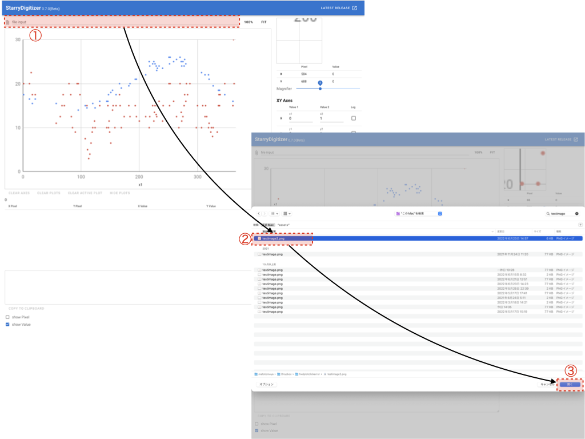
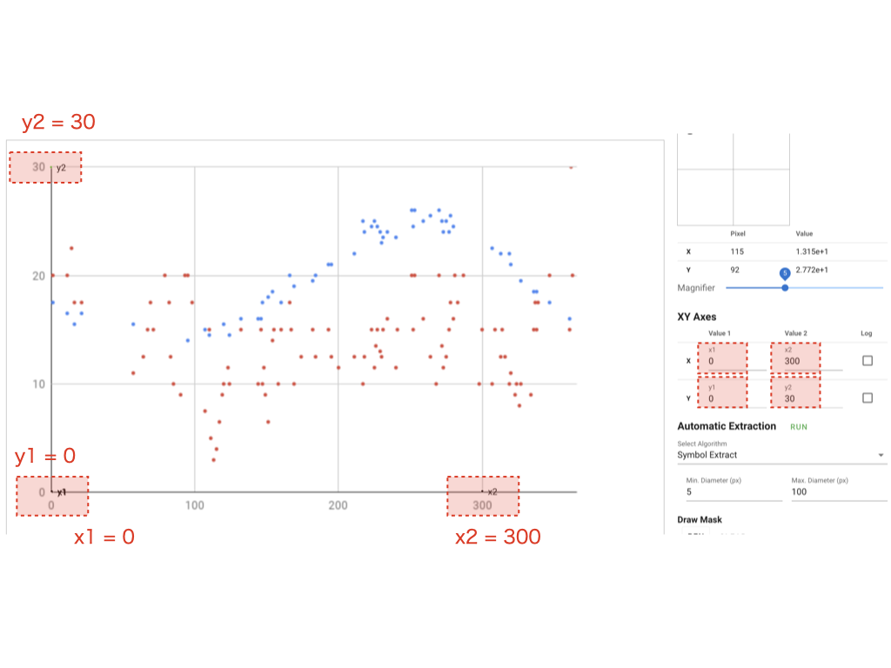
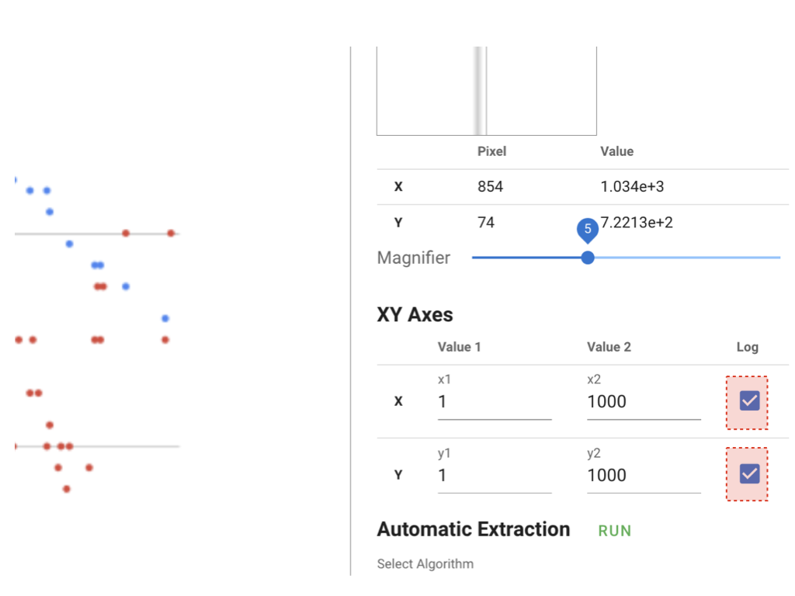

.. StarryDigizier documentation master file, created by
   sphinx-quickstart on Thu Jul  7 12:23:37 2022.
   You can adapt this file completely to your liking, but it should at least
   contain the root `toctree` directive.

StarryDigitizerドキュメント
##########################################

.. toctree::
   :maxdepth: 2
   :caption: Contents:

Indices and tables
##################

* :ref:`genindex`
* :ref:`modindex`
* :ref:`search`

使い方
************

1. グラフ画像の読み込み
=========================
「file input」からプロットを抽出したい画像ファイルを選択します。

.. image:: ./_static/SDD/SDD.001.png

2. XY軸の設定
=================
読み込んだ画像ファイルにマウスカーソルを持っていき、X軸とY軸を指定しましょう。
X軸（x1, x2）とY軸（y1, y2）で４点指定する必要があります。

3. XY軸の値の設定
===================

グラフのXY軸の値を目視で読み取り、右側の入力フィールドに値を入れてください。

3-1. ログスケールのグラフの場合
--------------------------------

XY軸の値の入力フィールドの右にある「Log」にチェックマークを入れてください。

4.
