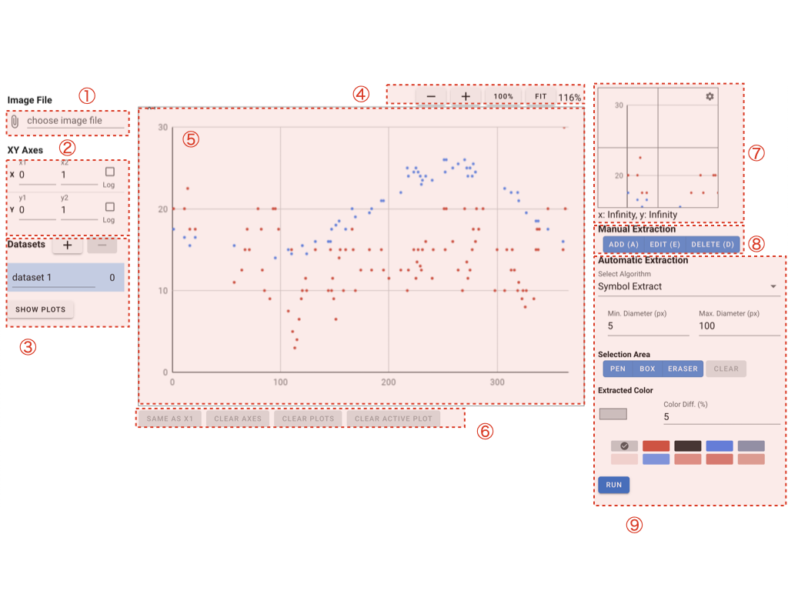

.. StarryDigizier documentation master file, created by
   sphinx-quickstart on Thu Jul  7 12:23:37 2022.
   You can adapt this file completely to your liking, but it should at least
   contain the root `toctree` directive.

StarryDigitizerドキュメント
##########################################

.. .. toctree::
..    :maxdepth: 2
..    :caption: Contents:

.. Indices and tables
.. ##################

.. * :ref:`genindex`
.. * :ref:`modindex`
.. * :ref:`search`

.. 1. 画面説明
.. ************

.. contents:: 画面説明
   :depth: 2

1. グラフ画像の読み込み
===============================
「file input」からプロットを抽出したい画像ファイルを選択できます。

2. 読み込んだ画像の調整
========================================
- 「-」：画像を縮小します。
- 「+」：画像を拡大します。
- 「100%」：画像の解像度と同一のサイズで表示します。
- 「FIT」：画像の横幅が最大になるように表示します。

3. 作業エリア
========================================
- XY軸（x1, x2, y1, y2）のマニュアル指定
- プロットのマニュアル抽出

が可能です。
XY軸の指定直後はアクティブになっており、カーソル移動で微調整できます。
プロットの移動は、プロットクリックして、カーソル移動することで位置調整できます。

3-1. プロットの操作
----------------------------------------------------------
すでに抽出済のプロットをクリックすることで編集モードに入れます。

3-2. プロットのまとめて操作
-----------------------------------------
Windowsでは「Ctrl」、Macでは「Command」ボタンと同時にプロットをクリックすることで、複数選択が可能です。
その後に、カーソル移動によりまとめて移動、また「CLEAR ACTIVE PLOTS」ボタンでまとめて削除が可能です。

4. ボタン類
========================================
- CLEAR AXES: XY軸（x1, x2, y1, y2）を全てクリアします。
- CLEAR PLOTS: プロットを全てクリアします。
- CLEAR ACTIVE PLOTS: 選択中のプロットをクリアします。
- HIDE PLOTS: プロットを非表示にします。

5. XY軸設定
========================================
作業エリアで指定したXY軸（x1, x2, y1, y2）に対して、それぞれXY値を入力できます。
ログスケールのグラフから抽出する場合は、XY軸それぞれで「Log」にチェックを入れてください。

6. プロットテーブル
========================================
抽出したプロットをテーブル形式で表示します。
- 1列目：プロットのXのピクセル値です。
- 2列目：プロットのYのピクセル値です。
- 3列目：プロットのXの実際の値です。
- 4列目：プロットのYの実際の値です。

7. プロットコピーエリア
========================================
抽出したプロットをコピーできます。
直接テキストエリアを編集することも可能ですが、他の箇所を操作することで最新のデータに上書きされます。

8. 拡大鏡
========================================
カーソルが当たってる作業エリアを拡大して表示します。
右上の「⚙」アイコンをクリックで「Magnifier」の拡大レベルの調整ができます。

9. 自動抽出
========================================
自動でプロットを抽出することできます。

9-1. Symbol Extract
---------------------------
散布図に向いています。
色によりシンボルの重心を抽出します。
シンボルが重なっている場合は、うまく抽出できないため、自動抽出後にマニュアル操作でプロットを調整する必要があります。

- 「Min. Diameter (px)」：指定した直径以上のシンボルのみ抽出するフィルタリングです。
- 「Max. Diameter (px)」：指定した直径以下のシンボルのみ抽出するフィルタリングです。

9-2. Line Extract
----------------------------
線グラフに向いています。
色により線の中心を抽出します。

- 「Min. Line Width (px)」：指定した線幅以上の線を抽出するフィルタリングです。傾きが大きな線については線幅を大きく誤抽出します。
- 「X Direction Interval (px)」：X方向のインターバルを指定します。X方向に希望のpx単位でプロットを抽出できます。

9-3. Mask
---------------------
自動抽出したい範囲をペンツールを用いてフィルタリングすることができます。半透明な黄色色で塗られた箇所のみ自動抽出対象となります。

9-4. Extracted Color
---------------------------
自動抽出で利用する色を選択できます。
初期表示の10色の色は、読み込んだ画像の中から色の割合が高いものが表示されます。
期待する色がない場合は、選択中の色を選択することで自由に変更できます。その場合スポイトツールを利用することをオススメします。

- 「Color Diff. (%)」：自動抽出する色の閾値を変更できます。解像度の高いグラフ画像で色に揺れ幅がない場合は1〜5を、解像度の低いグラフ画像で色に振れ幅がある場合は5以上がオススメです。

9-5. RUN
-----------------------
「RUN」ボタン押下で自動抽出、実行できます。

9-6. Tips
----------------------
自動抽出は元の画像の解像度に対して行うので、解像度の高い画像を用意してもらった方が自動抽出の精度は上がります。
